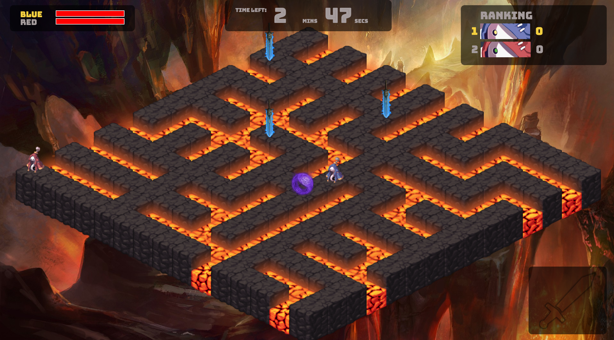
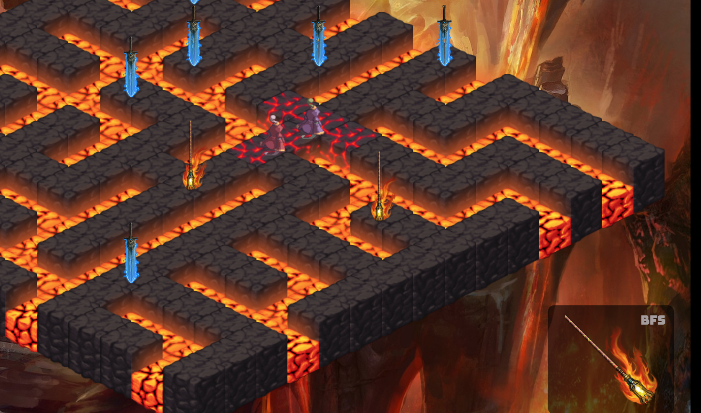

# A-maze Ball

[game live][game]

[game]: lilykwan.me:3000

A-maze Ball is a multi-player game with web sockets. The goal of the game is to hold onto the ball for the longest duration of time. Other players can kill the player holding the ball by picking up weapons and shooting at him/her. Once he/she is killed, the ball is released and another player can pick up the ball.

## Features & Implementation

### Maze Map

The map of the maze is randomly generated each time using Prim's algorithm. The Prim's algorithm was chosen to make this maze because it makes a lot of small dead-ends, as opposed to long, winding paths, making it more suitable for this game because players will be running around a lot.

### Weapons

There are two types of weapons: BFS range, and DFS range. BFS weapon finds the path using BFS algorithm, and vice versa for DFS. This way, the players have two options when they pick a weapon. If they want an area-of-effect, closer-range weapon, they can pick BFS weapon. If they want a more targeted, longer-range weapon, they can pick the DFS weapon.

### Multi-player feature
This game is implemented with a server to serve multiple clients playing the game at once. This means that the game was built on both the server-side, and the client-side. The game state is stored mainly on the server-side, such as player movements, player catching the ball, and player scores. This is to communicate game state across all clients, and to prevent cheating from clients.

## Technologies used
Node.js
Craftyjs
Socket.io
